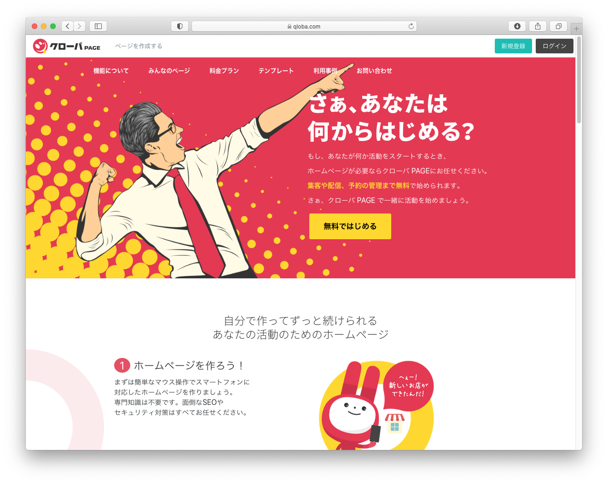
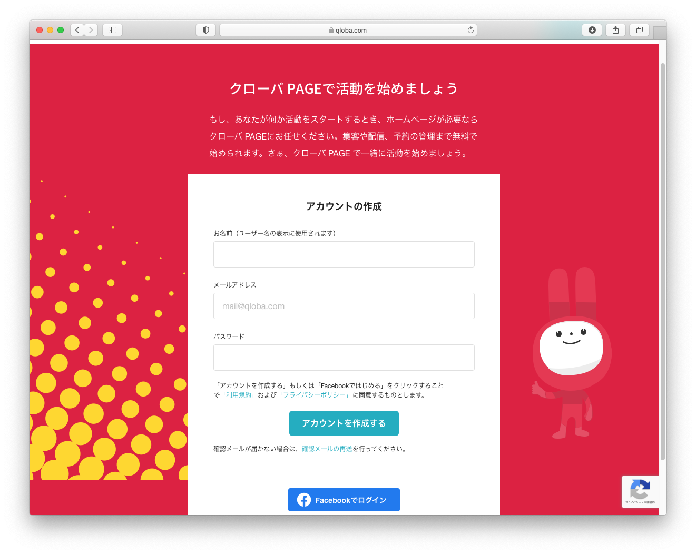
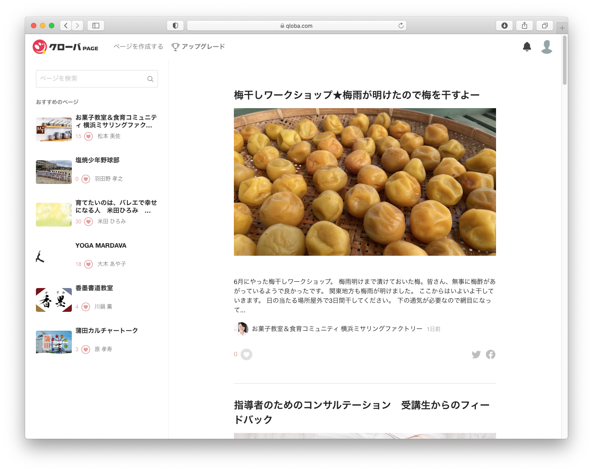
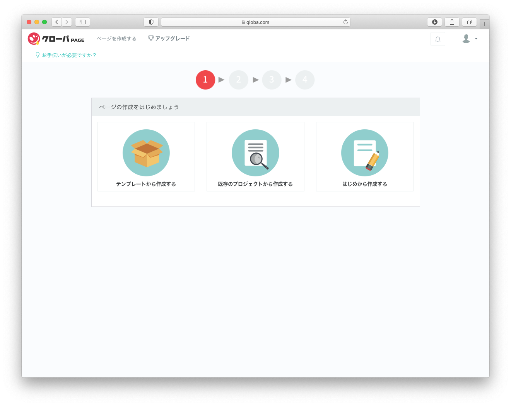
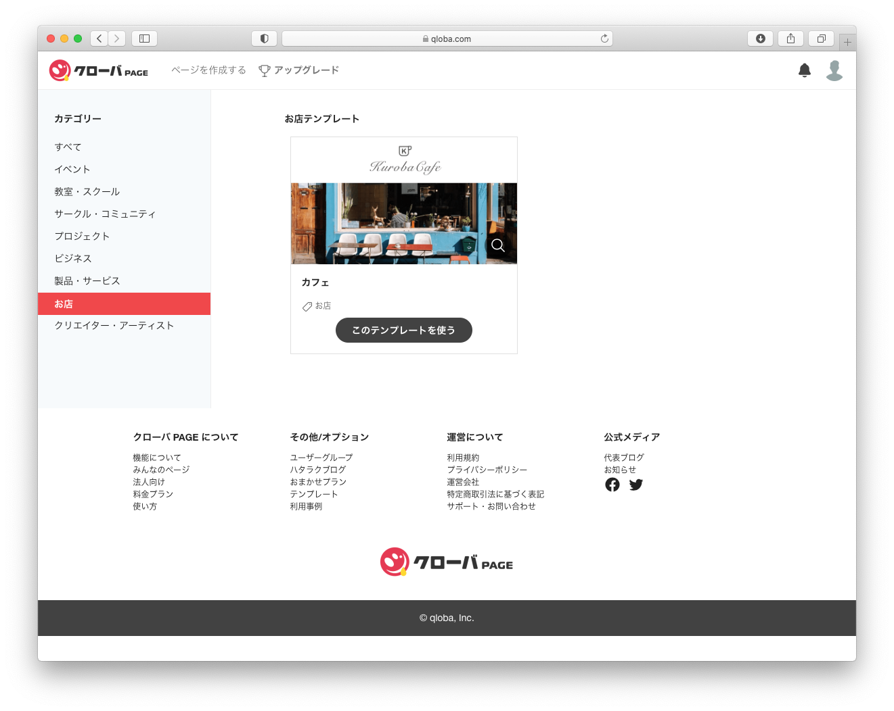
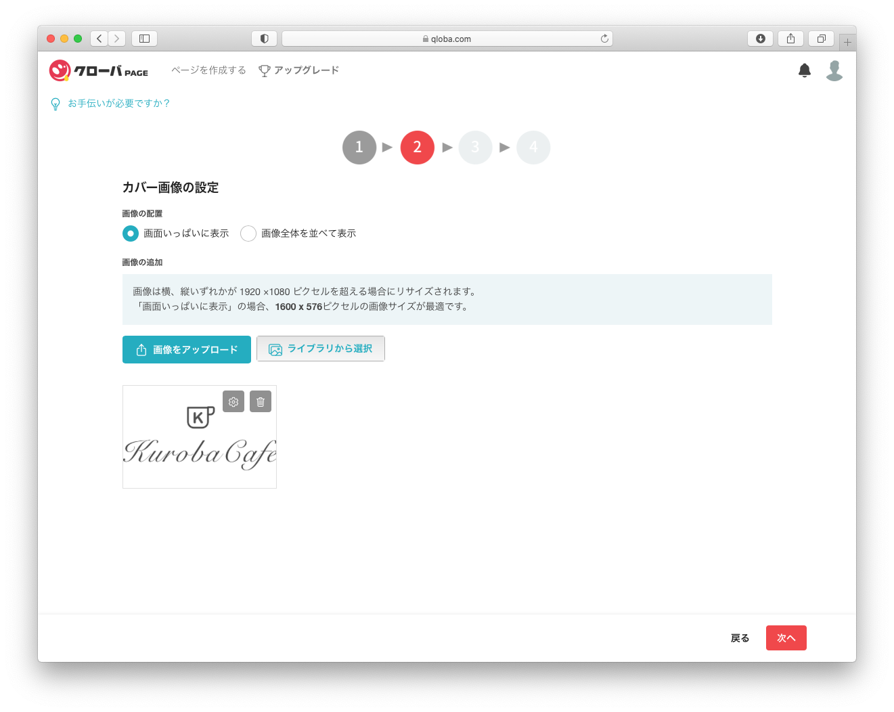
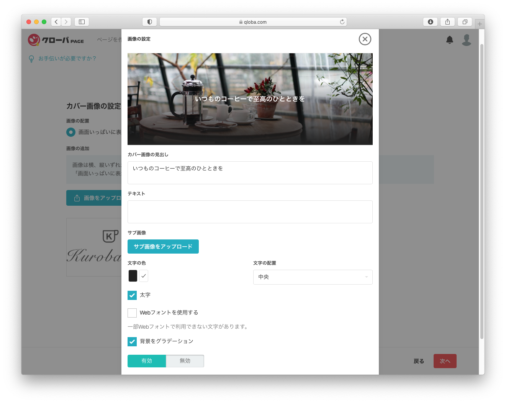
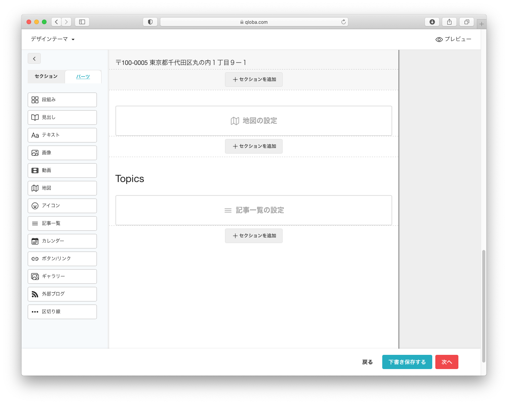
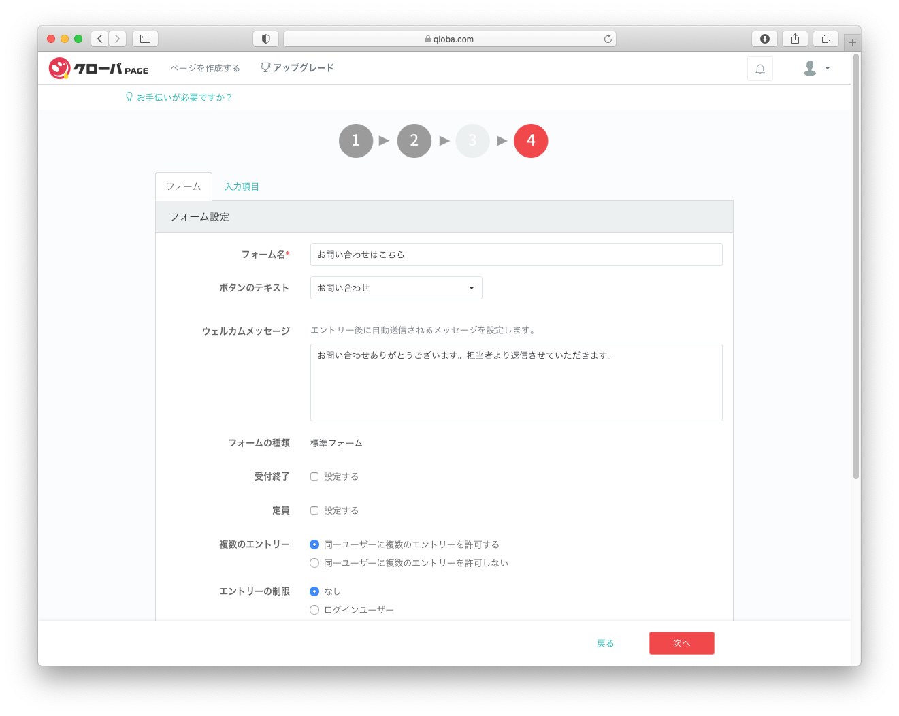
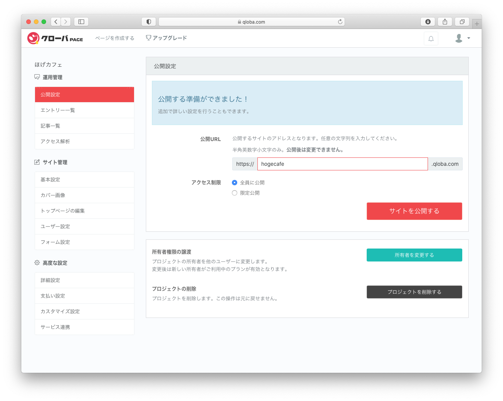

## あなたがもし、ホームページを作るとしたら？
あなたがもし、自分のお店のホームページを作るとしたらどうしますか？

まず最初に思いつくのが、ホームページ制作会社に頼んで作ってもらうことだと思います。  

でもその場合

<ul class="check-mark">
<li>どうやってホームページ制作会社を探せばいいのでしょう？</li>
<li>そこが、信頼できる制作会社だと、どうやって判断すればいいのでしょう？</li>
<li>こちらが何にも知らないのをいいことに、騙されやしないでしょうか？</li>
<li>また、費用はどのくらいかかるのでしょう？</li>
</ul>

心配のたねは尽きませんね。

いっそのこと、こういうのはどうでしょう？

&gt; ホームページを自分で作ってしまう

**そんなこととんでもない！自分にできるとはとても思えない** と仰っしゃるかもしれません。

でも実は、

## ホームページを自分で作成することは、そんなに難しくないんです

確かにかつては、サーバーを借りたり、ドメインを取ったり、ホームページ作成用のソフトを購入したり、やることがたくさんあってけっこう大変でした。

でも現在では、専門知識のない人でも、わりと簡単にホームページを作れちゃったりするんです。

そうです！

ホームページ作成サービスを使えば、 たった３０分でホームページができ上がってしまいます！

このサイトでは、専門知識のない方でも、簡単にホームページを作成できる方法を、紹介しています。

<!--
## 個人商店のホームページが失敗する理由
### 個人商店のホームページが更新されないのは？

### 制作会社に依頼すると、初期費用もそれなりにかかるが、運用費用が馬鹿にならない

### 失敗しないマインドセット
-->

「ホームページ作成サービス」はWix、Jimdo、Weebly、その他にもたくさんあります。それぞれ
特徴がありますが、ブラウザから操作して簡単にホームページを作成できるという点において、大きな違いはありません。

今回は、国産の<a href="https://www.qloba.com/" target="_blan">「クローバPAGE」</a>というサービスを
使っていきたいと思います。

<section id="lets-try">

<h2>ホームページ作成サービス 「クローバPAGE」を使ってみる</h2>

</section>

### それでは、さっそく「クローバPAGE」を使ってホームページを作成していきましょう。
操作は以下の６ステップです。 
びっくりするぐらい簡単ですので、気軽な気持ちでやってみましょう。

※ 各STEPタイトルをクリックすると、詳細が開きます。

STEP1 会員登録

まずは、会員登録からです。

<a href="https://www.qloba.com/">https://www.qloba.com/</a>から、クローバPAGEのサイトにアクセスしていください。

承認を求めるメールが届きますので、リンクをクリックしましょう。 
登録が完了すると、次の画面が表示されるので、「ページを作成する」のリンクをクリックしてください。

STEP2 テンプレートを選ぶ

まず最初にやることは、テンプレートを選ぶことです。 
テンプレートとは、ホームページの典型的な雛形のことで、ホームページの種類にあったデザインがあらかじめ用意されています。あまり深く考えず、それっぽいのを選んでみてください。

今回はカテゴリー「お店」の中から「カフェ」のテンプレートを選んでみました。

STEP3 カバー画像の設定

次にサイトにふさわしいカバー画像を指定します。 
カバー画像は、複数枚選択することができ、自分のお気に入りの写真をアップロードすることもできます。

カバー画像の上に表示される文字を指定します。
「いつものコーヒーで至高のひとときを」と入力しました。 
深く考えず、それっぽい文言を入力してみてください。

後からいくらでも変更可能ですので、気分でチャッチャと指定してみましょう。

STEP4 トップページはパーツをドラッグ＆ドロップで貼り付けていくだけけ

この「クローバPAGE」ではトップページだけの縦長のホームページを作成できます。
左側のパーツから、ドラッグ＆ドロップでセクションに貼り付けていきます。

画像や、動画、たくさんの種類のパーツが指定できますので、いろいろ試してみてください。

STEP5 問い合わせフォームの設定

訪問者からの問い合わせを受けるためのフォームを指定します。 
フォーム送信後に「ウェルカムメッセージ」を表示させることもできます。

STEP6 公開

最後に「公開」の設定です。 
URLの形式は「XXXXX.qloba.com｣となってます。XXXXXの部分を自由に指定できます。

いかがでしたでしょうか？
ものすごく簡単でしたでしょ？

再編集であとからいくらでも変更可能ですので、いろいろ試してみてください。

また、月々の費用がかかりますが、「アップグレード」すると、決済などの便利な機能が使えるようになります。

「クローバPAGE」では、ファンクラブなどの会員の管理機能に特化しているようです。 
気に入ったら使ってみるのも良いでしょう。

## 次のステップは？

